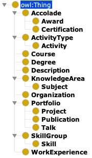

# Precis Ontology Structure

This document describes the structure of the Precis ontology. Note that this information is **not** necessary to use the Precis toolkit. It is here primarily for reference, and for anyone that wants to understand how the ontology is structured at a deeper level.

> **Note 1:** This document also has JSON schema descriptions (not a complete [JSON Schema](https://json-schema.org/) for now...) for each of the Concepts outlined in the Ontology. This information is not necessary to understand the Precis ontology structure, and is provided for reference purposes.

> **Note 2:** Unless otherwise stated, the `$id` field in JSON schema descriptions is optional. If left blank, the precis toolkit will auto-generate an ID on JSON ingestion. This will also mean that the instance in question will be un-referenceable, as a random ID will be generated upon ingestion.

> **Note 3:** The list of attributes described in the class JSON schema in this document are not exhaustive, and do not *necessarily* imply a required attribute of the given class.

## Overall Structure


<div style="text-align: center">
    
</div>

## Concepts (i.e. *Classes*)
This subsection describes each of the top-level concepts (or *classes*) in the Ontology. The heading level corresponds to the concept's position in the ontology class structure.

### Accolade

This concept is an umbrella class for anything that can be construed as an accolade of some sort. In the case of a traditional portfolio, this would be something that is classified as an award or certification; hence the current subclasses.

No concepts should be instantiated as an *Accolade*, but rather as one of its subclasses; *Award* or *Certification*. Thus, there is no construction information for this umbrella class.

#### Award

```json
{
    "$id": "User-defined ID",
    "inMonth": "Month the award was received",
    "externalResource": ["List of external resources"],
    "affiliatedWith": "ID of Degree/WorkExperience instance that this award is affiliated with",
    "hasDescription": ["List of Description objects corresponding to this instance"],
    "hasMedia": ["List of media (URLs) for media related to this instance"],
    "inYear": "Year the award was received",
    "hasName": "Name (for human consumption)",
    "relatedTo": "Related instances; can be anything in Precis"
}
```

This concept describes what may traditionally be described as an "award".

For example, this class would encapsulate something like "Dean's List", or "1st Place in Hackathon X". Note that in the case of the second example, it would be related to a "Hackathon", which would be linked using the `relatedTo` object property.

#### Certification

```json
{
    "$id": "User-defined ID",
    "inMonth": "Month the certification was received",
    "externalResource": ["List of external resources"],
    "affiliatedWith": "ID of Degree/WorkExperience instance that this certification is affiliated with",
    "hasDescription": ["List of Description objects corresponding to this instance"],
    "hasMedia": ["List of media (URLs) for media related to this instance"],
    "inYear": "Year the certification was received",
    "hasName": "Name (for human consumption)",
    "relatedTo": "Related instances; can be anything in Precis"
}
```

This concept describes what may traditionally be described as a "certification".

For example, this class would encapsulate something like "CPR Certification", or "Bloomberg Market Concepts Certificate". Note that in the case of the second example, it would be related to a *Course*, *Degree* or *Organization*, which would be linked using the `relatedTo` property.

### ActivityType

```json
{
    "$id": "User-defined ID",
    "inMonth": "Month the certification was received",
    "externalResource": ["List of external resources"],
    "hasDescription": ["List of Description objects corresponding to this instance"],
    "hasMedia": ["List of media (URLs) for media related to this instance"],
    "inYear": "Year the certification was received",
    "hasName": "Name (for human consumption)",
    "relatedTo": "Related instances; can be anything in Precis"
}
```

This concept would describe a "type" of Activity.

That is, it should be treated as an umbrella class to describe a set of activities that can be relegated to a specific "type". Examples of this would include a "Hackathon" *ActivityType*, which be a superclass to many individual instances of Hackathons.

#### Activity

```json
{
    "$id": "User-defined ID",
    "inMonth": "Month the Activity was completed",
    "externalResource": ["List of external resources"],
    "hasDescription": ["List of Description objects corresponding to this instance"],
    "hasMedia": ["List of media (URLs) for media related to this instance"],
    "inYear": "Year the Activity was completed",
    "hasName": "Name (for human consumption)",
    "relatedTo": "Related instances; can be anything in Precis"
}
```

This concept describes a specific *Activity*.

This should be an instance of a specific *ActivityType*. That is, it would be a specific Hackathon (which would in turn be a subclass of the "Hackathon" *ActivityType*).


### Course

```js
{
    "$id": "User-defined ID",
    "externalResource": ["List of external resources"],
    "hasDescription": ["List of Description objects corresponding to this instance"],
    "hasName": "Name (for human consumption)",
    "taughtAt": "Precis Organization instance that this course was taught at",
    "withGrade": "Grade received for this course",
    "hasWebsite": "Website for the course",
    "hasDepartmentCode": "Department code (eg: FIN, CSE, etc.)",
    "hasCourseCode": "Course code (eg: 423, 142, etc.)"
}
```

This concept describes a specific *Course*.

As stated in the name, this describes a course. This doesn't necessarily have to be associated with a specific Degeree, which provides flexibility to include things like Coursera/edX courses.

### Degree

```json
{
    "$id": "User-defined ID",
    "degreeConcentration": "Concentration of the Degree (URI to external concept)",
    "degreeDepartment": "Precis organization corresponding to the awarding department (eg: Department of Finance/Department of Computer Science)",
    "degreeGPA": "GPA of the degree (necessarily optional 🙃🔫)",
    "degreeSchool": "Precis organization corresponding to the awarding School (not University, but rather the College/School housing the Department, eg: School of Business, College of Engineering, etc.)",
    "degreeType": "Type of the degree (URI to external concept, eg: BA, MS, PhD, etc.)",
    "degreeUniversity": "Precis organization corresponding to the University (eg: University of Washington, Stevens Institute of Techonlogy, etc.)",
    "hasName": "Name (for human consumption)",
    "inCity": "City in which the degree was awarded",
    "inState": "State [or Country] in which the degree was awarded",
    "monthAwarded": "Month in which the degree was awarded",
    "yearAwarded": "Year in which the degree was awarded"
}
```

This concept describes a *Degree*.

Contrary to how this is traditionally represented on a CV, think of this as a container, encapsulating a set of organizations that awarded the Degree (i.e. the Department, School/College, and University). In addition to linking all of these related organizations with relevant object relation descriptors, this class also stores traditional information associated with a degree, such as the Degree type, title, etc.

### Description


### KnowledgeArea

#### Subject


### Organization


### Portfolio

#### Project

#### Publication

#### Talk


### SkillGroup

#### Skill


### WorkExperience

## Object Properties (i.e. *Relationships*)

- 
